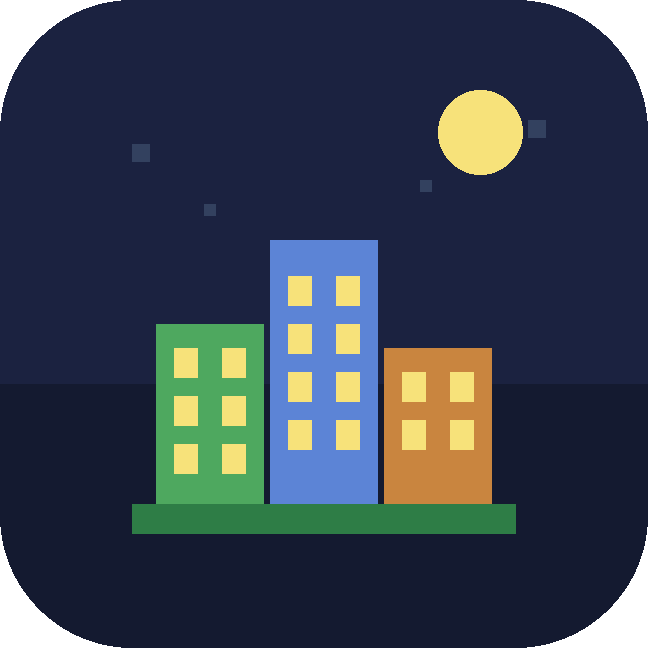

# CristiVerse on Android

CristiVerse runs on Android phones and tablets with full touch controls, a
landscape‑locked layout, and a clean adaptive launcher icon. The whole game is
the same pure‑SDL2 C++ code as the desktop build — only a thin Java activity and
a Gradle/NDK build wrapper are Android‑specific.

---

## What you get

| Feature | Detail |
|---|---|
| **Touch controls** | Tap = select agent / deploy tool · one‑finger drag = pan · two‑finger pinch = zoom |
| **Orientation** | Locked to **landscape** (`sensorLandscape`, flips for either side) |
| **Readable UI** | Renders at a logical resolution and scales to the screen, so text and buttons stay finger‑sized on high‑DPI phones |
| **Launcher icon** | Adaptive **vector** icon (no PNGs) — crisp at every density |
| **Battery friendly** | vsync‑capped 60 fps, auto‑pauses when sent to the background |
| **Hardware back** | Android Back button walks out one screen at a time (Play → Pause → Menu) |

### Performance defaults (low‑end phones)
On Android the game starts with mobile‑tuned defaults chosen for a steady
**60 fps on low‑end devices (~8 GB RAM, weak GPU)**:

- `numAgents = 700`, `numBuildings = 44`, `numTrees = 80`
- `worldW = worldH = 2000`
- vsync on, fullscreen on

All of these are still editable in **Settings** and persist to the app's private
storage. Bump the agent/building sliders up on stronger devices.

---

## Prerequisites

- **JDK 17**
- **Android SDK** (platform `android-34`, build‑tools `34.0.0`)
- **Android NDK** `26.1.10909125`
- **CMake** `3.22.1` (the one bundled with the Android SDK is fine)
- **SDL2 source** `2.30.9` — fetched automatically by the script below

The easiest way to get the SDK/NDK/CMake is **Android Studio** (Giraffe or
newer). The command‑line `sdkmanager` works too.

---

## Build — Android Studio (recommended)

```bash
# 1. From the repo root, fetch the SDL2 source + its Java glue:
android/fetch-sdl.sh
```

2. Open the **`android/`** folder in Android Studio. Let it sync Gradle.
3. Press **Run** (or *Build ▸ Build APK*). Studio downloads the NDK/CMake if
   missing and installs the APK on a connected device or emulator.

> The first build compiles SDL2 from source, so it takes a few minutes; later
> builds are incremental.

---

## Build — command line

```bash
# From the repo root:
android/fetch-sdl.sh                 # downloads SDL2 2.30.9 + copies SDL Java glue

cd android
# If you don't already have a Gradle wrapper, generate one once:
gradle wrapper --gradle-version 8.2  # requires a system Gradle >= 8
./gradlew assembleDebug              # -> app/build/outputs/apk/debug/app-debug.apk

# Install on a connected device:
./gradlew installDebug
# or:
adb install -r app/build/outputs/apk/debug/app-debug.apk
```

A release build:

```bash
./gradlew assembleRelease            # unsigned; sign before publishing
```

---

## Continuous integration

`.github/workflows/android.yml` builds a debug APK on every push: it sets up
JDK 17 + the Android SDK/NDK/CMake, runs `fetch-sdl.sh`, and uploads the APK as
a build artifact (and attaches it to tagged releases). Use it as the reference
for the exact toolchain versions.

---

## How the touch mapping works

The native game (`src/Game.cpp`) handles SDL finger events directly:

- SDL's touch→mouse synthesis is **disabled** so finger events are the single
  source of truth.
- The **primary finger mirrors into the UI cursor**, so every existing
  immediate‑mode widget (menus, sidebar buttons, sliders) works unchanged.
- Over the **world view** a gesture layer adds: tap → select/deploy,
  drag → pan, two‑finger pinch → zoom. A small movement threshold distinguishes
  a tap from the start of a pan, so panning never accidentally deploys a unit.

Finger coordinates are converted into the game's logical render space with
`SDL_RenderWindowToLogical`, so hit‑testing lines up exactly with what's drawn
regardless of the device's pixel density.

---

## The launcher icon



The icon is a pure **adaptive vector** icon (`minSdk 26`), so there are no PNG
mipmaps to manage and it stays crisp at every density and under any launcher
mask shape (the PNG above is just a rounded-mask preview):

```
android/app/src/main/res/
  drawable/ic_launcher_background.xml   # night sky + stars
  drawable/ic_launcher_foreground.xml   # pixel‑art skyline, moon, lit windows
  mipmap-anydpi-v26/ic_launcher.xml     # <adaptive-icon> tying them together
  mipmap-anydpi-v26/ic_launcher_round.xml
  values/colors.xml                     # ic_launcher_background color
```

To restyle it, edit the two `drawable/ic_launcher_*.xml` vectors — the building
colors mirror the in‑game palette.

---

## Troubleshooting

- **`SDL_SRC_DIR must point to the SDL2 source tree`** — run
  `android/fetch-sdl.sh` before building (it populates `android/SDL/`).
- **`org.libsdl.app` classes not found** — the same script copies SDL's Java
  glue into `android/app/src/main/java/org/`. Re‑run it.
- **NDK/CMake version mismatch** — install the exact versions listed above, or
  edit `ndkVersion` / `cmake { version }` in `android/app/build.gradle`.
- **Black screen on launch** — confirm the device supports OpenGL ES 2.0 (every
  Android 8.0+ device does) and check `adb logcat` for the
  `CristiVerse: WxH physical -> WxH logical` line that confirms native start‑up.
