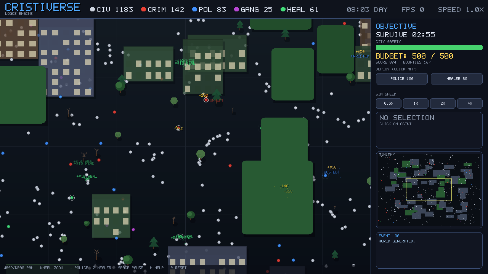

# CristiVerse — LogOS Engine (SDL2 Edition)

A living-city simulation sandbox where thousands of autonomous agents roam,
trade, commit crimes, get arrested, and get healed — all on their own. You play
the **mayor**: keep the city safe long enough to win by deploying police and
healers while the simulation plays out.

This is a full redesign of the original single-file `cristiverse_sdl2.cpp`
prototype into a modular, polished, downloadable game. It uses **pure SDL2** —
no SDL_ttf / SDL_image / SDL_mixer. The bitmap font and sound effects are
generated procedurally; buildings, roads, and trees are drawn from small
**pixel-art sprites** in [`assets/`](assets) (PNG decoded with the vendored
single-header `stb_image`, so there is still no SDL_image dependency). If the
sprite art is missing the renderer **falls back to the original procedural
look**, so the game never fails to start.



---

## ✨ Features

- **Modular C++17 codebase** — config, math, font, rendering, simulation, UI,
  audio, and game-state are cleanly separated.
- **Retro pixel-art graphics** — a cohesive blocky aesthetic: chunky buildings
  with flat roofs and big lit windows, little pixel-figure citizens, blocky trees
  (deciduous, pine, willow, dead), a checkerboard grass ground, dirt roads, park
  ponds and flower patches, cast shadows, factory smoke, and a day/night cycle.
- **Depth-sorted world** — buildings, trees, agents, and traffic are painted
  back-to-front by base Y, and a building turns semi-transparent (x-ray) when an
  agent walks behind it. Zoom no longer disturbs the window pattern.
- **Organic, living cities** — buildings are small and grow in tight **clusters**
  (a packed little skyline per city block, with open ground and empty lots
  between) instead of one cube per square, so neighborhoods look hand-built. A
  **City Depth** slider (1–10) controls density: higher depth shrinks the world,
  tightens the road grid, and packs more buildings per block for a dense
  downtown; lower depth spreads scattered, low-rise neighborhoods. Cars, luxury
  cars, and trucks drive the streets as cosmetic background traffic.
- **Custom building placement** — pick **HOUSE / OFFICE / FACTORY / PARK** from
  the sidebar and click the map to place your own buildings (free in Sandbox,
  costs budget in Survival), and tune the auto-generated mix with the Settings
  **BUILDING MIX** sliders (residential / office / industry / park ratios).
- **Day/night life** — a 24-hour clock drives window colour (dark blue at night,
  white-yellow at midday, orange at dusk); civilians walk home and sleep indoors
  between 22:00 and 06:00, then spill back out at dawn.
- **Animations** — agent walk-bob and facing, action flash rings
  (rob / arrest / heal / fight), floating event text, drifting particles,
  smooth camera pan/zoom, and a fade-in.
- **Agent AI with 5 roles** — Civilians flee threats, crack under stress, and
  sleep at night; Criminals hunt and rob; Police chase and arrest; Gangs fight
  police; Healers calm and heal. A spatial grid keeps neighbor queries fast.
- **Built-in UI toolkit** — buttons, toggles, sliders, panels, a top HUD with
  live role counts, a clock, and an on-screen entity counter, a selected-agent
  info/edit panel, a minimap with a live camera viewport box, and a scrolling
  event log.
- **Two modes** — a timed **Survival** challenge (earn bounties for arrests and
  heals, then beat the clock for a high score) and a **Sandbox** with unlimited
  budget, free entity spawners, and live agent-stat editing.
- **Game loop** — Menu → Playing → Paused → Game Over, settings + help screens,
  0.5×/1×/2×/4× speed control, a safety meter, a snowballing budget economy,
  deployable units, and win/lose conditions with scoring.
- **Procedural audio** — synthesized SFX (click, select, crime, arrest, deploy,
  win, lose) with a master volume. Fails gracefully on machines with no audio.
- **Config file** — `cristiverse.cfg` is read at launch and saved on exit; tune
  resolution, agent count, and quality without recompiling.
- **Runs on Android** — the same C++ core builds into a touch-controlled,
  landscape phone game with an adaptive launcher icon. Tap to select/deploy,
  drag to pan, pinch to zoom, tuned for a steady 60 fps on low-end devices.
  See **[ANDROID.md](ANDROID.md)**.

---

## 🎮 How to play

You are the mayor. The city simulates itself — your job is to keep **City Safety**
above zero until the **Survive** timer runs out.

- Crime and high stress drain City Safety. Police reduce crime (they arrest and
  rehabilitate criminals). Healers reduce stress.
- Deploying units costs **Budget** (Police 100, Healer 80). You start with 200
  and the economy **snowballs**: every arrest pays **+$50**, every heal **+$10**,
  plus steady city income and a periodic tax — so an active mayor can fund a
  growing force. Budget caps at 500.
- Survive the timer with safety above zero to **win**. Let it hit zero and the
  city is **lost**. Your score is `arrests×10 + heals×5 + time (+ leftover safety)`.

### Sandbox mode

Pick **Sandbox** from the menu for free creative play: unlimited budget, no timer
or safety pressure, spawners for every role (keys `3`–`7`), live editing of a
selected agent's stress / health / money, a placement grid (`G`), and one-key
population respawns (`N`).

### Controls

| Input | Action |
|-------|--------|
| `W A S D` / Arrow keys / right-drag | Pan the camera |
| Mouse wheel | Zoom in/out |
| Left click | Select an agent (edit it in Sandbox) |
| `1` / `2` | Toggle the **Police** / **Healer** deploy tool, then click the map |
| `3` `4` `5` `6` `7` | *(Sandbox)* spawn Civilian / Criminal / Police / Healer / Gang |
| `G` / `N` | *(Sandbox)* toggle placement grid / respawn population |
| `Tab` | Cancel the active tool |
| `[` / `]` | Slower / faster simulation speed |
| `Space` | Pause / resume |
| `H` | Help screen |
| `R` | Generate a brand-new city |
| `Esc` | Back one step (Playing → Paused → Menu → quit) |

### Touch controls (Android)

| Gesture | Action |
|---------|--------|
| Tap | Select an agent, deploy the active tool, or press a UI button |
| One-finger drag (on the map) | Pan the camera |
| Two-finger pinch | Zoom in/out |
| Drag a slider / tap a button | Works exactly like the mouse |
| Hardware/gesture **Back** | Back one step (Playing → Paused → Menu) |

---

## ⬇️ Downloads (prebuilt)

Prebuilt **Windows** and **Linux** packages are produced automatically by GitHub
Actions:

- **Tagged releases:** see the [Releases](../../releases) page for attached
  `CristiVerse-Windows.zip` and `CristiVerse-Linux.tar.gz`.
- **Latest build of any commit:** open the **Actions** tab → the most recent
  *Build* run → download the artifacts at the bottom.

On Windows, unzip and run `CristiVerse.exe` (keep `SDL2.dll` next to it).
On Linux, extract and run `./run.sh`.

An **Android** debug `.apk` is built by the *Android* workflow — grab it from the
**Actions** tab (or a tagged release) and `adb install` it, or sideload it onto a
phone. Build it yourself with **[ANDROID.md](ANDROID.md)**.

---

## 🔨 Building from source

### Linux

```bash
sudo apt-get install -y libsdl2-dev cmake g++   # Debian/Ubuntu
cmake -S . -B build -DCMAKE_BUILD_TYPE=Release
cmake --build build -j
./build/bin/CristiVerse
```

Or just run `scripts/build-linux.sh`.

### macOS

```bash
brew install sdl2 cmake
cmake -S . -B build -DCMAKE_BUILD_TYPE=Release
cmake --build build -j
./build/bin/CristiVerse
```

### Windows (MSVC)

1. Download the SDL2 **VC** development package from
   <https://github.com/libsdl-org/SDL/releases> (e.g. `SDL2-devel-2.30.9-VC.zip`)
   and extract it somewhere.
2. Configure and build, pointing CMake at it:

   ```powershell
   cmake -S . -B build -A x64 -DCMAKE_PREFIX_PATH="C:\path\to\SDL2-2.30.9"
   cmake --build build --config Release
   ```

3. The build copies `SDL2.dll` next to `build\bin\Release\CristiVerse.exe`.

### Windows (MSYS2 / MinGW)

```bash
pacman -S mingw-w64-x86_64-SDL2 mingw-w64-x86_64-cmake mingw-w64-x86_64-gcc
cmake -S . -B build -G "MinGW Makefiles" -DCMAKE_BUILD_TYPE=Release
cmake --build build -j
```

### Android

```bash
android/fetch-sdl.sh          # download SDL2 source + its Java glue
# Easiest: open the android/ folder in Android Studio and press Run.
# CLI: generate the wrapper once (needs a system Gradle >= 8), then build:
cd android && gradle wrapper --gradle-version 8.2 && ./gradlew assembleDebug
```

Full instructions, prerequisites, and troubleshooting are in
**[ANDROID.md](ANDROID.md)**.

---

## ⚙️ Configuration

A `cristiverse.cfg` file is read from the working directory at startup and
written back on exit. See [`packaging/cristiverse.cfg`](packaging/cristiverse.cfg)
for all keys (resolution, agent/building counts, graphics toggles, audio). You can
also change most of these live from the in-game **Settings** screen.

---

## 🧩 Project layout

```
src/
  Config.{h,cpp}   Settings struct + config-file load/save
  Math.h           Vec2, RNG, easing, color helpers
  Font.{h,cpp}     Built-in 5x7 bitmap font (no SDL_ttf)
  Render.{h,cpp}   Camera, world<->screen, draw primitives
  Sim.{h,cpp}      Agents, buildings, particles, spatial grid, AI step
  UI.{h,cpp}       Immediate-mode widgets (button/toggle/slider/panel)
  Audio.{h,cpp}    Procedural SFX engine
  Textures.{h,cpp} Sprite loader/cache (PNG via stb_image, BMP via SDL core)
  stb_image.h      Vendored single-header PNG decoder (public domain)
  Game.{h,cpp}     State machine, input, world + UI rendering
  main.cpp         Entry point (+ headless --shot screenshot mode)
assets/            Pixel-art sprites (buildings, roads, trees, vehicles)
CMakeLists.txt     Cross-platform build (desktop + Android)
android/           Android project (Gradle + adaptive icon + SDL fetch script)
.github/workflows/ CI that builds Windows, Linux & the Android APK
packaging/         Example config used in release zips
scripts/           Local build & package helpers
```

See [MODDING.md](MODDING.md) to tweak the simulation, colors, or building types.

---

## 📷 Generating a screenshot (headless)

The executable can render a frame without a window — handy for CI smoke tests:

```bash
./build/bin/CristiVerse --shot out.bmp 200   # simulate 200 frames, save BMP
```
